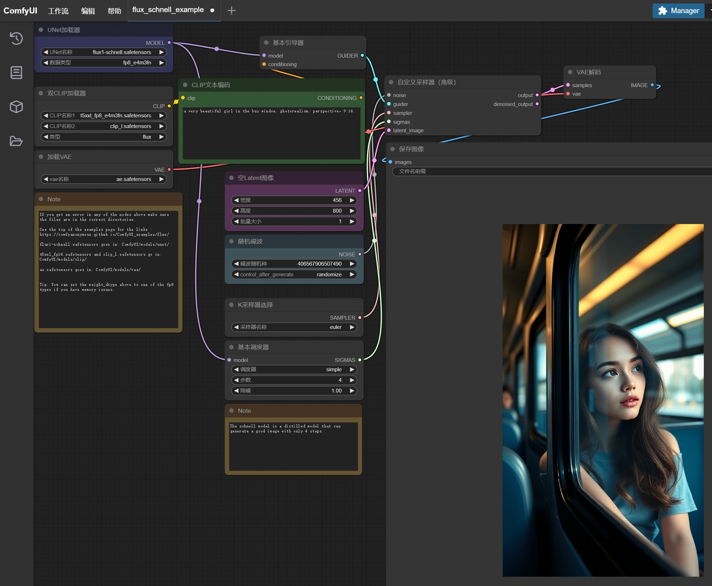

# Visited: http://lewlh.github.io/2025/02/26/AmdRx580AITestComfyuiZluda/
**Time:** Mon May 11 11:25:39 UTC 2026

## Favicon

## Screenshot

## Raw HTML
[page.html](./page.html)

## Downloaded Media (10 files)
## Downloaded Media Files

- [rocblas.for.gfx803.override.with.vega10.7z](./media/rocblas.for.gfx803.override.with.vega10.7z) (5137 KB)

## Other Links
- [#%E4%B8%8B%E8%BD%BD%E4%BE%9D%E8%B5%96](#%E4%B8%8B%E8%BD%BD%E4%BE%9D%E8%B5%96)
- [#%E5%9C%A8ComfyUI%E4%B8%AD%E9%85%8D%E7%BD%AE%E4%BD%BF%E7%94%A8Flux](#%E5%9C%A8ComfyUI%E4%B8%AD%E9%85%8D%E7%BD%AE%E4%BD%BF%E7%94%A8Flux)
- [#%E9%83%A8%E7%BD%B2FLUX-1-schnell](#%E9%83%A8%E7%BD%B2FLUX-1-schnell)
- [#ComfyUI-Zluda%E7%9A%84%E5%AE%89%E8%A3%85%E9%83%A8%E7%BD%B2](#ComfyUI-Zluda%E7%9A%84%E5%AE%89%E8%A3%85%E9%83%A8%E7%BD%B2)
- [#References](#References)
- [/](/)
- [/2025/02/25/LearnLLMByChattingWithLLM/](/2025/02/25/LearnLLMByChattingWithLLM/)
- [/2025/03/02/AmdRx580AITestWan/](/2025/03/02/AmdRx580AITestWan/)
- [/about/](/about/)
- [/archives/](/archives/)
- [/css/main.css](/css/main.css)
- [/css/noscript.css](/css/noscript.css)
- [/js/config.js](/js/config.js)
- [/js/motion.js](/js/motion.js)
- [/js/next-boot.js](/js/next-boot.js)
- [/js/sidebar.js](/js/sidebar.js)
- [/js/third-party/analytics/google-analytics.js](/js/third-party/analytics/google-analytics.js)
- [/js/third-party/comments/gitalk.js](/js/third-party/comments/gitalk.js)
- [/js/third-party/fancybox.js](/js/third-party/fancybox.js)
- [/js/third-party/tags/mermaid.js](/js/third-party/tags/mermaid.js)
- [/js/third-party/tags/pdf.js](/js/third-party/tags/pdf.js)
- [/js/utils.js](/js/utils.js)
- [/sitemap.xml](/sitemap.xml)
- [/tags/](/tags/)
- [/tags/Flux/](/tags/Flux/)
- [/tags/RX580/](/tags/RX580/)
- [/tags/comfyui/](/tags/comfyui/)
- [/tags/zluda/](/tags/zluda/)
- [http://127.0.0.1:8188/](http://127.0.0.1:8188/)
- [http://lewlh.github.io/2025/02/26/AmdRx580AITestComfyuiZluda/](http://lewlh.github.io/2025/02/26/AmdRx580AITestComfyuiZluda/)
- [https://aka.ms/vs/17/release/vc_redist.x64.exe](https://aka.ms/vs/17/release/vc_redist.x64.exe)
- [https://busuanzi.ibruce.info/busuanzi/2.3/busuanzi.pure.mini.js](https://busuanzi.ibruce.info/busuanzi/2.3/busuanzi.pure.mini.js)
- [https://cdnjs.cloudflare.com/ajax/libs/KaTeX/0.16.9/katex.min.css](https://cdnjs.cloudflare.com/ajax/libs/KaTeX/0.16.9/katex.min.css)
- [https://cdnjs.cloudflare.com/ajax/libs/animate.css/3.1.1/animate.min.css](https://cdnjs.cloudflare.com/ajax/libs/animate.css/3.1.1/animate.min.css)
- [https://cdnjs.cloudflare.com/ajax/libs/animejs/3.2.1/anime.min.js](https://cdnjs.cloudflare.com/ajax/libs/animejs/3.2.1/anime.min.js)
- [https://cdnjs.cloudflare.com/ajax/libs/fancyapps-ui/5.0.36/fancybox/fancybox.css](https://cdnjs.cloudflare.com/ajax/libs/fancyapps-ui/5.0.36/fancybox/fancybox.css)
- [https://cdnjs.cloudflare.com/ajax/libs/fancyapps-ui/5.0.36/fancybox/fancybox.umd.js](https://cdnjs.cloudflare.com/ajax/libs/fancyapps-ui/5.0.36/fancybox/fancybox.umd.js)
- [https://cdnjs.cloudflare.com/ajax/libs/font-awesome/6.7.2/css/all.min.css](https://cdnjs.cloudflare.com/ajax/libs/font-awesome/6.7.2/css/all.min.css)
- [https://cdnjs.cloudflare.com/ajax/libs/gitalk/1.8.0/gitalk.css](https://cdnjs.cloudflare.com/ajax/libs/gitalk/1.8.0/gitalk.css)
- [https://cdnjs.cloudflare.com/ajax/libs/lozad.js/1.16.0/lozad.min.js](https://cdnjs.cloudflare.com/ajax/libs/lozad.js/1.16.0/lozad.min.js)
- [https://comfyanonymous.github.io/ComfyUI_examples/flux/#flux-schnell](https://comfyanonymous.github.io/ComfyUI_examples/flux/#flux-schnell)
- [https://github.com/likelovewant/ROCmLibs-for-gfx1103-AMD780M-APU](https://github.com/likelovewant/ROCmLibs-for-gfx1103-AMD780M-APU)
- [https://github.com/likelovewant/ROCmLibs-for-gfx1103-AMD780M-APU/releases/tag/v0.5.7](https://github.com/likelovewant/ROCmLibs-for-gfx1103-AMD780M-APU/releases/tag/v0.5.7)
- [https://github.com/lshqqytiger/ZLUDA](https://github.com/lshqqytiger/ZLUDA)
- [https://github.com/patientx/ComfyUI-Zluda](https://github.com/patientx/ComfyUI-Zluda)
- [https://hexo.io/](https://hexo.io/)
- [https://huggingface.co/black-forest-labs/FLUX.1-schnell/blob/main/ae.safetensors](https://huggingface.co/black-forest-labs/FLUX.1-schnell/blob/main/ae.safetensors)
- [https://huggingface.co/black-forest-labs/FLUX.1-schnell/blob/main/flux1-schnell.safetensors](https://huggingface.co/black-forest-labs/FLUX.1-schnell/blob/main/flux1-schnell.safetensors)
- [https://huggingface.co/comfyanonymous/flux_text_encoders/blob/main/clip_l.safetensors](https://huggingface.co/comfyanonymous/flux_text_encoders/blob/main/clip_l.safetensors)
- [https://huggingface.co/comfyanonymous/flux_text_encoders/blob/main/t5xxl_fp8_e4m3fn.safetensors](https://huggingface.co/comfyanonymous/flux_text_encoders/blob/main/t5xxl_fp8_e4m3fn.safetensors)

## Stats
- Links: 68
- Media: 10
