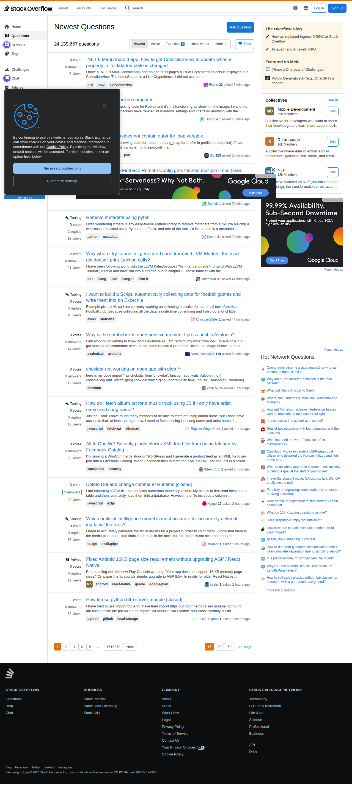

# Visited: https://stackoverflow.com
**Time:** Sun May 10 15:31:09 UTC 2026

## Favicon

## Screenshot

## Raw HTML
[page.html](./page.html)

## Downloaded Media (3 files)
## Downloaded Media Files

## Other Links
- [#](#)
- [#content](#content)
- [/](/)
- [/beta/challenges](/beta/challenges)
- [/collectives](/collectives)
- [/collectives-all](/collectives-all)
- [/collectives/aws](/collectives/aws)
- [/collectives/azure](/collectives/azure)
- [/collectives/ci-cd](/collectives/ci-cd)
- [/collectives/google-cloud](/collectives/google-cloud)
- [/collectives/mobile-dev](/collectives/mobile-dev)
- [/collectives/php](/collectives/php)
- [/contact](/contact)
- [/help](/help)
- [/opensearch.xml](/opensearch.xml)
- [/px.js?ch=1](/px.js?ch=1)
- [/px.js?ch=2](/px.js?ch=2)
- [/questions](/questions)
- [/questions/79938797/best-synchronization-method-between-reaper-and-grandma3-using-osc-and-timecode](/questions/79938797/best-synchronization-method-between-reaper-and-grandma3-using-osc-and-timecode)
- [/questions/79938799/how-do-i-pass-query-parameters-to-sort-form-to-achieve-filtering-pagination-and](/questions/79938799/how-do-i-pass-query-parameters-to-sort-form-to-achieve-filtering-pagination-and)
- [/questions/79938800/dompdf-stalls-when-called-from-laravel-queue-worker-to-convert-table-with-large](/questions/79938800/dompdf-stalls-when-called-from-laravel-queue-worker-to-convert-table-with-large)
- [/questions/79938801/rc522-module-acting-weird](/questions/79938801/rc522-module-acting-weird)
- [/questions/79938804/getting-encryption-algorithmfield-id-8-in-filemetadata-for-parsing-rowgroupfi](/questions/79938804/getting-encryption-algorithmfield-id-8-in-filemetadata-for-parsing-rowgroupfi)
- [/questions/79938807/in-app-purchases-not-loading-in-ios-sandbox](/questions/79938807/in-app-purchases-not-loading-in-ios-sandbox)
- [/questions/79938808/how-does-the-c-compiler-detect-which-function-to-start-first](/questions/79938808/how-does-the-c-compiler-detect-which-function-to-start-first)
- [/questions/79938809/nodemailer-not-sending-emails-after-deployment-on-render](/questions/79938809/nodemailer-not-sending-emails-after-deployment-on-render)
- [/questions/79938812/meta-business-graphql-add-payment-method-button-remains-disabled-after-runnin](/questions/79938812/meta-business-graphql-add-payment-method-button-remains-disabled-after-runnin)
- [/questions/79938816/to-store-bootstrap-folder-terraform-state-to-s3-backend-with-migration-approach](/questions/79938816/to-store-bootstrap-folder-terraform-state-to-s3-backend-with-migration-approach)
- [/questions/79938821/unity-bluetooth-obd-ii-reader-setup-not-working-on-k-line](/questions/79938821/unity-bluetooth-obd-ii-reader-setup-not-working-on-k-line)
- [/questions/79938829/why-does-trying-to-call-this-external-program-from-a-python-script-result-in-err](/questions/79938829/why-does-trying-to-call-this-external-program-from-a-python-script-result-in-err)
- [/questions/79938830/flutter-scrollview-inside-fixed-height-listview-doesnt-propagate-scroll-to-par](/questions/79938830/flutter-scrollview-inside-fixed-height-listview-doesnt-propagate-scroll-to-par)
- [/questions/79938833/best-static-stack-analyzers-for-steck-depth-in-vtaskcreate-in-freertos](/questions/79938833/best-static-stack-analyzers-for-steck-depth-in-vtaskcreate-in-freertos)
- [/questions/79938835/rest-api-fetches-data-very-slow-how-to-make-it-fast](/questions/79938835/rest-api-fetches-data-very-slow-how-to-make-it-fast)
- [/questions/79938836/dispatching-an-action-when-another-is-being-reduced](/questions/79938836/dispatching-an-action-when-another-is-being-reduced)
- [/questions/79938839/how-should-i-architect-a-lightweight-cross-platform-package-registry-and-toolcha](/questions/79938839/how-should-i-architect-a-lightweight-cross-platform-package-registry-and-toolcha)
- [/questions/79938841/i-get-an-error-when-im-trying-ti-upload-a-file-on-my-server-php-mysql-error](/questions/79938841/i-get-an-error-when-im-trying-ti-upload-a-file-on-my-server-php-mysql-error)
- [/questions/79938845/i-cannot-make-array-find-to-return-required-value](/questions/79938845/i-cannot-make-array-find-to-return-required-value)
- [/questions/79938849/reason-for-having-different-conditional-statements](/questions/79938849/reason-for-having-different-conditional-statements)
- [/questions/79938850/webflux-netty-invalidlineseparatorexception-line-feed-must-be-preceded-by-c](/questions/79938850/webflux-netty-invalidlineseparatorexception-line-feed-must-be-preceded-by-c)
- [/questions/79938865/healthcheck-for-kafka-for-docker-compose](/questions/79938865/healthcheck-for-kafka-for-docker-compose)
- [/questions/79938866/enable-marker-tracking-for-meta-quest-3-unity-for-scanning-physical-devices-an](/questions/79938866/enable-marker-tracking-for-meta-quest-3-unity-for-scanning-physical-devices-an)
- [/questions/79938869/no-access-control-allow-origin-header-is-present-on-the-requested-resource-wh](/questions/79938869/no-access-control-allow-origin-header-is-present-on-the-requested-resource-wh)
- [/questions/79938871/connection-reset-while-transferring-large-files-in-http-response](/questions/79938871/connection-reset-while-transferring-large-files-in-http-response)
- [/questions/79938874/get-explanations-with-owl-api-openllet-for-data-assertion-axioms](/questions/79938874/get-explanations-with-owl-api-openllet-for-data-assertion-axioms)
- [/questions/79938877/turing-completeness-for-a-cpu](/questions/79938877/turing-completeness-for-a-cpu)
- [/questions/79938879/applying-a-specific-condition-for-a-total-in-python](/questions/79938879/applying-a-specific-condition-for-a-total-in-python)
- [/questions/79938887/change-the-toolbar-buttons-appearance-in-firefox-using-css](/questions/79938887/change-the-toolbar-buttons-appearance-in-firefox-using-css)
- [/questions/79938903/smart-commit-in-youtrack](/questions/79938903/smart-commit-in-youtrack)
- [/questions/79938907/how-to-call-a-py-from-within-python-along-with-a-variable](/questions/79938907/how-to-call-a-py-from-within-python-along-with-a-variable)
- [/questions/79938910/how-would-i-from-a-button-in-html-launch-a-python-file-in-github](/questions/79938910/how-would-i-from-a-button-in-html-launch-a-python-file-in-github)

## Stats
- Links: 423
- Media: 3
